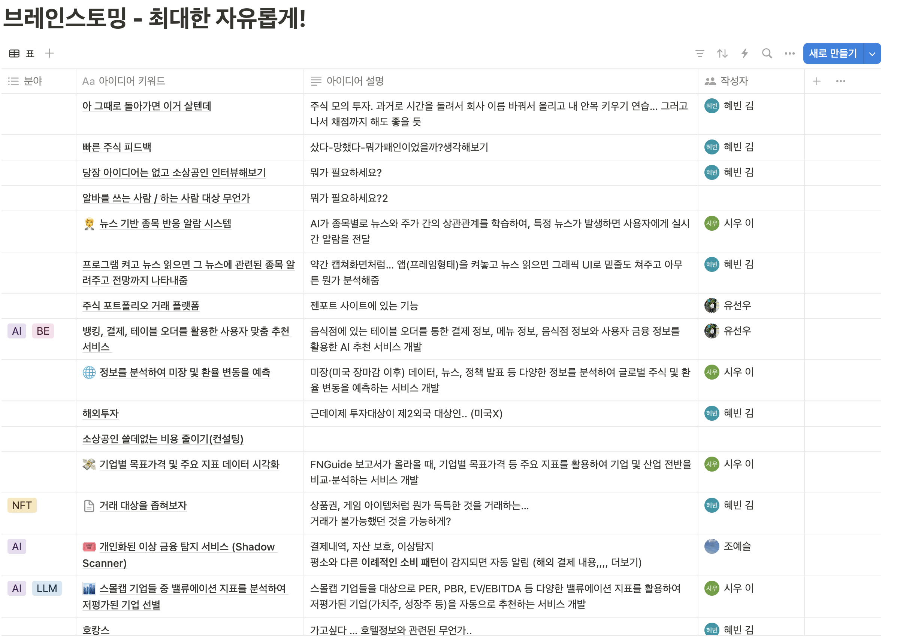
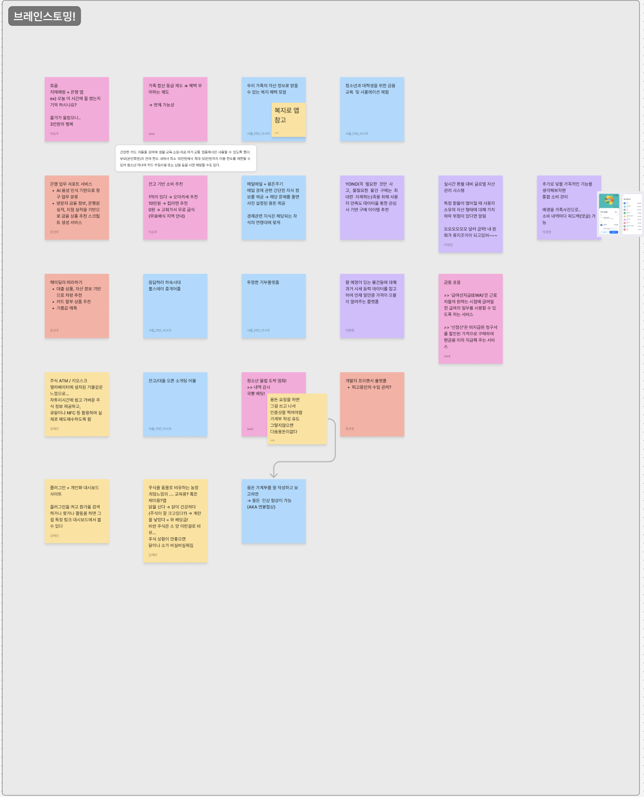
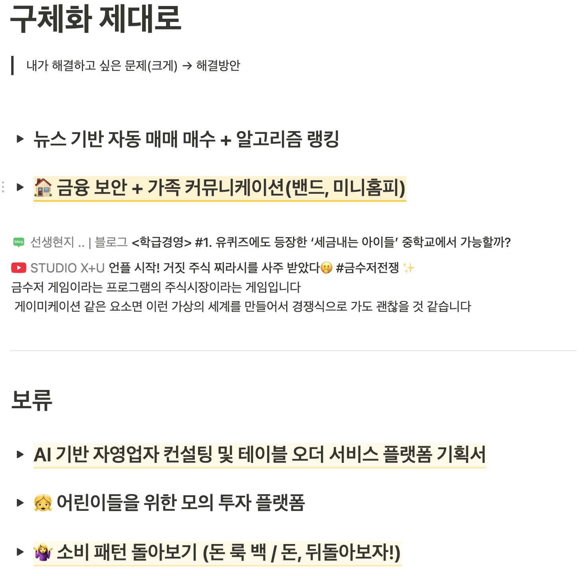
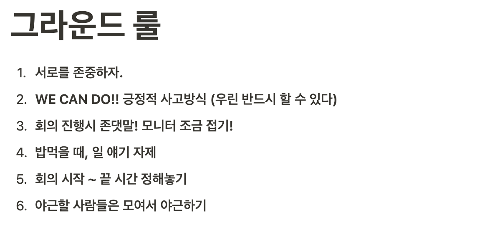
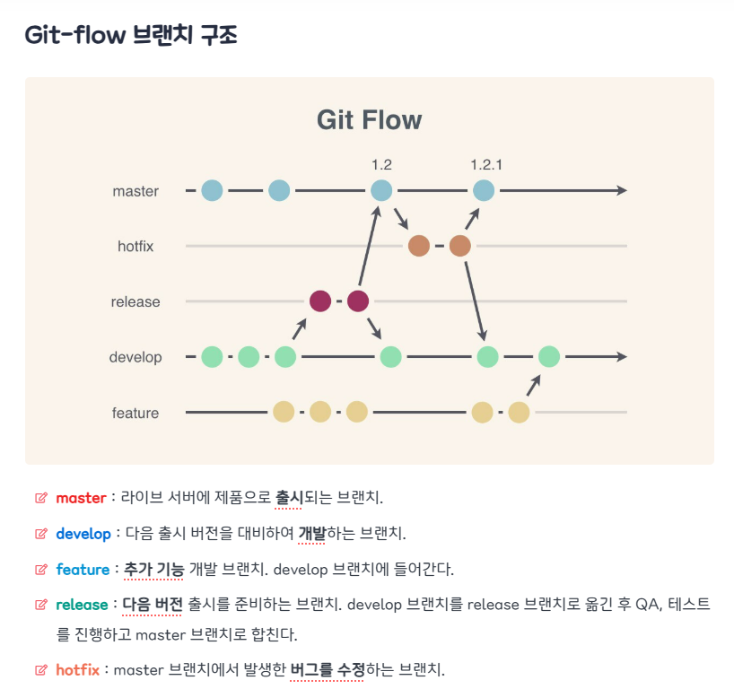
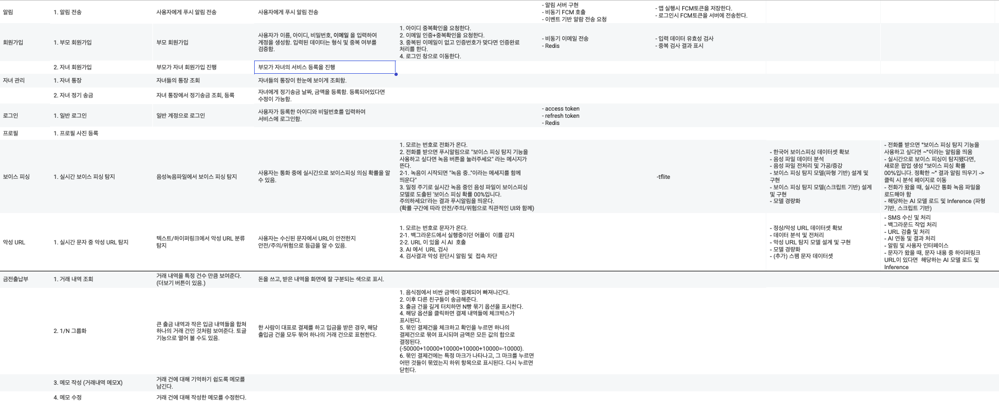
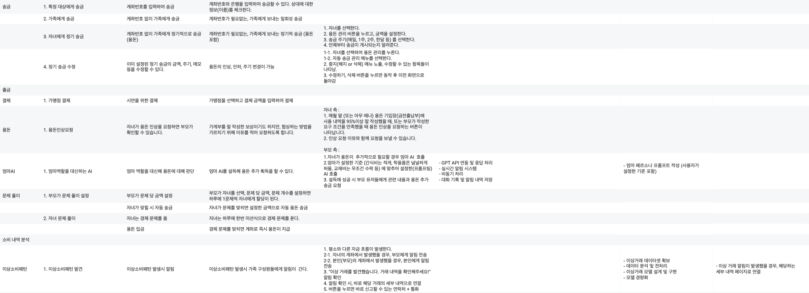

# 팀 활동

## 3/4 ##

### 브래인스토밍


<br>



### 아이디어 구체화


<br>

### 그라운드룰


## 3/5 ##

### 아이디어 최종 구체화

### 💫 가족 핀테크 플랫폼

> 가족 구성원 간 **자산 관리, 정기 송금, 소비 분석, 금융 교육**, 그리고 **AI 기반 보안 기능**을 제공하는 올인원 금융 서비스.

#### 🎯 **핵심 목표**

- ~~가족 단위의 금융 관리 최적화~~
- 자녀 금융 교육 & 관리 기능 제공
- AI 기반 보이스피싱·스미싱 차단으로 보안 강화
- 부모와 자녀 모두의 금융 생활을 지원하는 기능 통합

#### ~~1️⃣ **가족 계좌 시스템**~~

~~가족 계좌를 등급별로 나누어 맞춤형 금융 관리를 제공~~

~~✔️ **계좌 등급** (개인 / 부부 / 가족)~~

~~✔️ **가족 공유 계좌** - 특정 지출을 공유하며 관리~~

~~✔️ **적금·예금 상품 추천** (가족 구성원의 금융 상태 분석 기반)~~

#### 2️⃣ **부모·자녀 송금 시스템**

✔️ **부모 계좌** → 자녀에게 정기 용돈 송금

✔️ **자녀 계좌** → 부모님께 정기적으로 용돈 받기 & 송금(가족 외에는 계좌 정보 직접 입력)

#### **3️⃣미성년자 자녀 금융 관리**

✔️ **자녀 결제 내역 조회** - 전월 대비 소비 패턴 변화 분석

✔️ **또래 자녀 소비 비교** - 연령대별 평균 소비 항목 제공

✔️ **용돈(정기) 올리기 요청** - 요청 시 부모에게 자동 메시지 발송

- 요청이 왔을 때, 부모는 자녀의 소비 현황 리포트를 기반으로 결정
- **~~AI 기반 용돈 추천** (자녀 소비 패턴 분석 기반)~~

✔️ **용돈(1회성) 추가 요청** - 요청 시 부모에게 자동 메시지 발송

> 엄마 AI를 설득해라!! (설득의 왕이 되어라, 올바른 소비습관 형성하자!)
> 
- 설득에 성공하면 AI가 “승인” 반환 → 부모에게 요청 메시지 전송
- 설득에 실패하면 AI가 “거절” 반환 → 뿌엥

**✔️ 용돈 가계부** ~~→ 이후 토픽모델링 통해서 업종 분류~~

- ~~일기 (음성/텍스트) ⇒ 생성형으로 거래 내역 자동으로 추출~~
- 거래 내역 상세 작성 기능
- 금전 출납부 (1/n 시 묶어서 그룹화)

#### 4️⃣ **금융 교육 & 인센티브**

✔️ **자녀 매일 1문제 풀기 →** 정답 시 용돈 지급

- 문제 당 가격 부모가 정하게

✔️ 부모 연동 계좌에서 **자동 송금 기능** 지원

✔️ **맞춤형 금융 지식 제공**

### **🛡️ AI 기반 보안 기능**

> 부모 유입 전략 << 자녀를 겨냥한 보이스피싱 꾸준히 발생
> 

**✅ 보이스 피싱 & 스미싱 차단**

- 부모·자녀 대상 **AI 기반 실시간 딥보이스 피싱 감지**
    - 피싱이 의심된다고 결과가 나오면 위치 추적 기능 ON
- **악성 URL 탐지** (스미싱 공격 차단)
- **이상소비패턴 탐지**

---

### MVP 제외 추가할만한 아이디어

1. 용돈 가계부를 잘 작성하고 보고하면
-> 용돈  인상 협상이 가능
(AKA 연봉협상)
2. 엄마 AI - 추가 용돈을 주는 AI
    1. 엄마가 설정한 기준 (간식비는 적게, 학용품은 널널하게 허용, 교재비는 무조건 수락 등) 에 맞추어 설정한 금액 내에서 용돈 추가 지급.
    2. 프롬프팅!
    3. 설득 되면 바로 추가 지급이 아니라 용돈 추가 요청을  보내는거로 해야될거 같아요.
    4. 지금까지의 소비 내역을 요약해서 AI 에도 넣고, 엄마에게 요청 보낼 때도 쉽게 확인할 수 있도록. - 원래도 자녀 소비 패턴 확인하는 기능은 필요하니까 연동?
    5. 요청이 오면 엄마는 자녀의 AI설득 내역을 확인할 수 있다.
3. 시니어 - 나의 부모 금융 보호하기
4. 저축하면 보너스
5. 자녀계좌 (크면줄게) - 적금 상품 생성후 추천 리스트에 반영
6. 엄마한테 돈 빌리기

<br>

### 깃허브 컨벤션

#### Git Flow 전략



1. **배포 브랜치**:
    - FE-prod
    - BE-prod
    - AI-prod
    - APP-prod
2. **개발 브랜치**:
    - FE-dev
    - BE-dev
    - AI-dev
    - APP-dev
3. **작업 브랜치**:
    - `S12P11A307-38-be-회원가입-api-설계-및-구현`
        - 이슈 발행 : [BE] 회원가입 API 설계 및 구현
    - `S12P11A307-40-hotfix-회원가입-api-설계-및-구현`
        - 이슈 발행 : [Hotfix] 회원가입 API 설계 및 구현

---

### Commit 컨벤션

#### 기본 형식

```arduino
<type>: <description>
```

#### 요소 설명

1. **type**: 커밋의 종류를 나타내며, 일반적으로 다음과 같은 타입 사용
    - `feat`: 새로운 기능 추가
    - `fix`: 버그 수정
    - `docs`: 문서 수정
    - `style`: 코드 포맷팅, 세미콜론 누락 등 (로직 변화 없음)
    - `refactor`: 코드 리팩토링 (기능 변화 없음)
    - `test`: 테스트 추가 또는 수정
    - `chore`: 빌드 프로세스 또는 보조 도구 변경 (build.gradle, application.yml, docker-compose 등)
2. **description**: 변경 내용을 간결하게 설명. 명령형으로 작성

#### 예시

```
feat(auth): 사용자 로그인 기능 추가

새로운 OAuth 로그인 기능을 구현하였으며, Google 및 Facebook 로그인을 지원함.
기존 인증 방식과의 호환성을 유지하면서도 보안을 강화함.

Closes #45

```

### PR 형식

> 이슈 단위로 PR 작성 (작업시간 최대 6시간)
> 
- **제목 (필수)**: 변경/추가 사항의 요약
    - `[이슈번호] 제목`
- **설명 (필수)**: 변경/추가 내역 및 설명, 주요 변경 사항, 관련된 Issue 번호
- **스크린샷 또는 데모** (선택 사항)

**태그**

- `FE`
- `BE`
- `INFRA`
- `PLAN`
- `BUG`
- `TEST`
- `REFACTOR`
- `DESIGN`

### 코드 리뷰

- 팀원전 2명 이상이 `승인` 또는 `리뷰`해야 머지가 가능함
    - 기본 : `승인`
    - 필요시 : `리뷰` 진행
- 승인 / 리뷰 제한시간 **24시간**
    - 하루에 한번은 꼭 확인해보기

## 3/6 ##

[기능명세서](https://docs.google.com/spreadsheets/d/18udjgIw0vvDpLsfX2RyGkfYM8D1KLHt-TEaGdw_QsIw/edit?usp=sharing)


